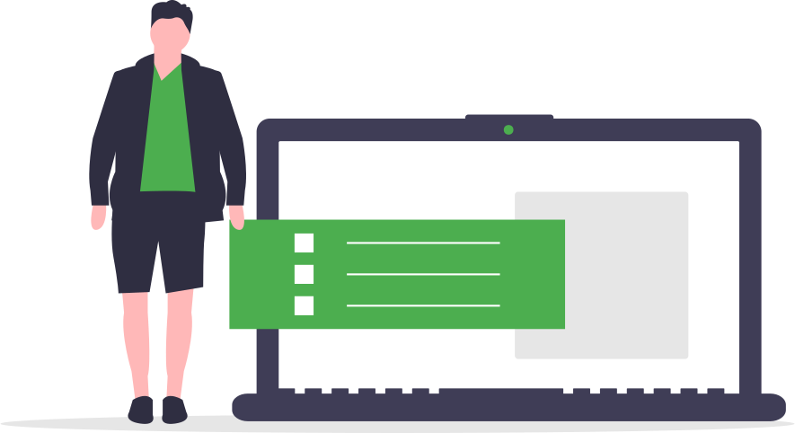
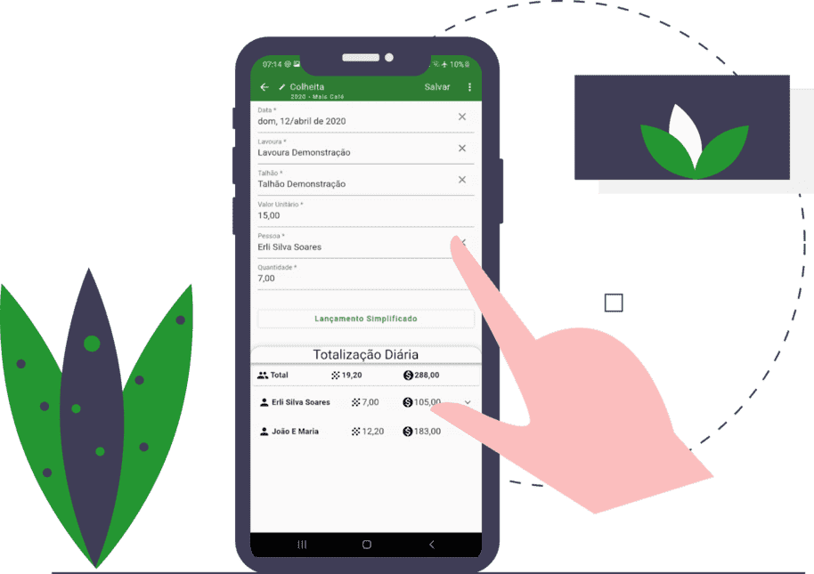
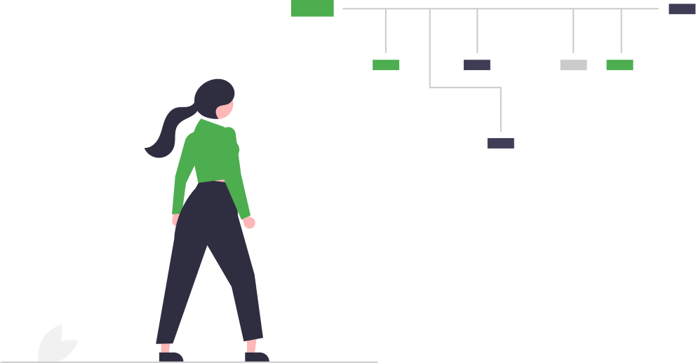
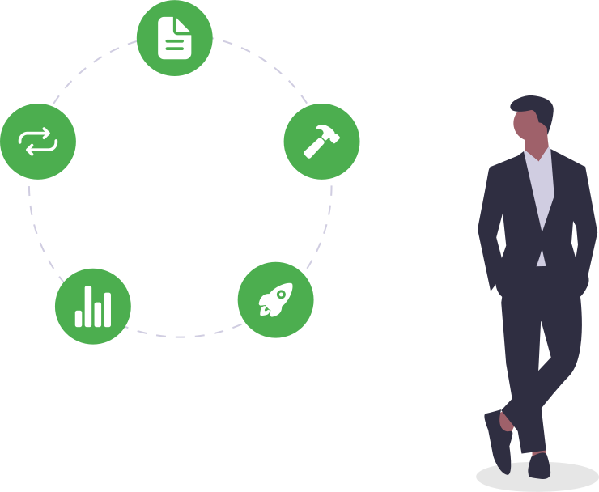
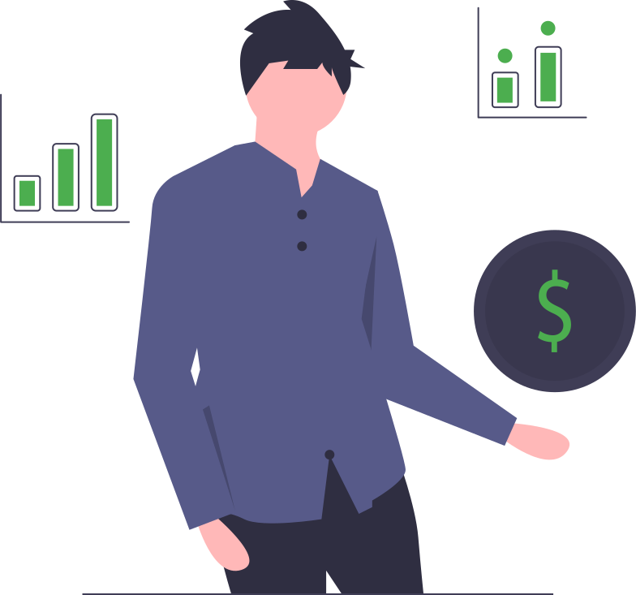
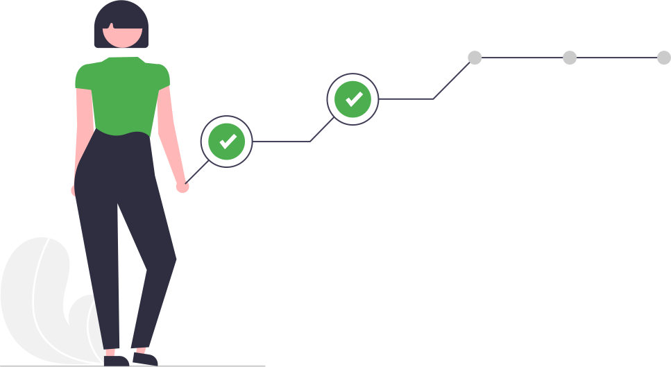

--8<-- "includes/abbreviations.md"

<section>
  

    <h1>O Início de Tudo</h1>
    

      

        
      

      

        <ul class="rb">
          <li class="rb-item" ng-repeat="itembx">
            

              <strong>2010</strong> - O Problema
            

            
Começamos a controlar a colheita de café da nossa propriedade pela planilha do Excel
            

            <small class="item-description">
              Ajudou muito a controlar a colheita, mas com o tempo trouxe várias dores de cabeça, além de ser limitado.
            </small>
          </li>
          <li class="rb-item" ng-repeat="itembx">
            

              <strong>2019</strong> - A Ideia
            

            
Início do desenvolvimento do aplicativo

            <small class="item-description">
              9 anos após <a href="./equipe/">Erli</a> sair da roça e trabalhar com desenvolvimento de software, ele
              inicia o desenvolvimento do aplicativo para ajudar seu irmão na colheita do café.
            </small>
          </li>
          <li class="rb-item" ng-repeat="itembx">
            

              <strong>2020</strong> - A Solução
            

            
Utilização do aplicativo para controle da colheita

            <small class="item-description">
              Irmão do <a href="./equipe/">Erli</a> passa a utilizar o aplicativo. 
              Mais de 100 pessoas instalam o aplicativo, isso sem nenhuma divulgação ou propaganda.
            </small>
          </li>
          <li class="rb-item" ng-repeat="itembx">
            

              <strong>2021</strong> - Nascimento do Mais Café
            

            
Estruturamos todo o aplicativo e o negócio

            <small class="item-description">
              <dl>
                <dt>O Aplicativo</dt>
                <dd>
                  - Reescrevemos todo o aplicativo do zero para permitir crescer. 
                  - Criamos mais de 10 cadastros no aplicativo para servir como base para o cálculo custo de
                  produção. 
                  - Iniciamos a documentação de todo aplicativo. 
                </dd>
                <dt>O Negócio</dt>
                <dd>
                  - Evoluímos a ideia do aplicativo para tratar o Mais Café como uma empresa. 
                  - Foi montado um time, não está somente na mão de uma pessoa. 
                  - Definimos a cultura da empresa. 
                  - Melhoramos a cara do negócio, criamos vídeos institucional, website, etc. 
                </dd>
              </dl>
            </small>
          </li>
          <li class="rb-item" ng-repeat="itembx">
            

              <strong>2022</strong> - Expansão do Produto
            

            
Foco no desenvolvimento do aplicativo

            <small class="item-description">
              

              Em 2022 o foco da equipe é no desenvolvimento do aplicativo, vamos focar nesse ano em melhorar o processo de colheita, <a href="./recursos/#planejamento-para-2022">saiba mais</a>.
              

            </small>
          </li>
        </ul>
      

    

  

</section>

<section class="haze">
  

    <h1>Nosso Produto</h1>
    

      

        
O aplicativo pode ser comparado a uma lavoura de 2 a 3 anos, já compensa colher o café, mas a lavoura não está no auge de sua produção.

        
Assim é o aplicativo, não temos todos os recursos disponíveis, mas acreditamos que já pode te ajudar.

        Recursos úteis:
        <ul>
          <li>Registrar no mapa a localização dos talhões e medir os hectares da área.</li>
          <li>Registrar a colheita do café, separando para cada talhão e apanhador.</li>
          <li>Registrar a venda do café beneficiado.</li>
          <li>Lançar as doenças, pragas e anotações direto pelo mapa.</li>
          <li>Suporte para várias propriedades.</li>
        </ul>
      

      

        
      

    

  

</section>

<section>
  

    <h1>Nossos Valores</h1>
    

      

        
      

      

        <small>
          <ul>
            <li>Agir com integridade e dentro dos mais elevados padrões éticos não é negociável. </li>
            <li>Fazemos o que é certo e sempre cumprimos nossas promessas.</li>
            <li>Transparência em tudo que fazemos e com todos.</li>
            <li>Confiamos uns nos outros e trabalhamos juntos para fazer o trabalho, a melhor ideia vence.</li>
            <li>Atrair e reter talentos da mais alta qualidade e desenvolvê-los para que se tornem melhores do que nós.</li>
            <li>Tomamos decisões e agimos como donos do negócio, pensamos a longo prazo e não tomamos atalhos, para construir uma empresa sustentável.</li>
            <li>Acreditamos que todos podem ser líderes e que a verdadeira liderança é conquistada por meio de nossas ações, não com nossos títulos.</li>
            <li>Reconhecemos, recompensamos e celebramos o desempenho excepcional.</li>
            <li>Acreditamos que construir uma sociedade mais justa é possível quando pessoas incríveis estão dispostas a transformar vidas.</li>
            <li>Retribuir nosso crescimento com a sociedade é um dever.</li>
            <li>Consideramos o erro como parte do processo de aprendizagem, acreditamos que toda solução simples nasce de um experimento.</li>
          </ul>
        </small>
      

    

  

</section>

<section class="haze">
  

    <h1>Nossa Missão</h1>
    

      

        <h2 style="color:var(--md-primary-fg-color);font-weight:bold;margin-top:0;padding-top:0;">Tornar a Tecnologia Acessível aos Cafeicultores</h2>
        <h3>
          Nossa missão vai além de criar soluções tecnológicas, é tornar acessível aos pequenos e médios cafeicultores o que há de melhor da tecnologia. 
        </h3>
        

          Saiba mais em <a href="./objetivos/">objetivos</a>.
        

      

      

        
      

    

  

</section>

<section>
  

    <h1>Nossos Investidores</h1>
    

      

        
      

      

        <h3>
          
Não temos nenhum investidor, enxugamos ao máximo para gerar o mínimo possível de gastos.

          
Hoje não temos nenhuma receita, todos colaborares tem outro trabalho para se manter financeiramente.

          
Todos os gastos são pagos pelo <a href="./equipe/">Erli</a>, mas estamos montando uma <a href="./preco/">proposta de cobrança</a> para os novos recursos que seja bom para todos.

        </h3>
      

    

  

</section>

<section class="haze">
  

    <h1>Nosso Diferencial</h1>
    

      

        
Somos uma equipe apaixonados pelo o que fazemos, cheio de ideias e vontade de fazer a diferença. Parte de nós nasceu e cresceu em meio a cafeicultura e conhece de perto o dia a dia do campo.

        
Nosso diferencial:

        <ul>
          <li>Entre em contato diretamente com quem faz acontecer.</li>
          <li>Integrantes da equipe tem mais de 8 anos em desenvolvimento de sistemas para grandes empresas, sabendo os prós e contras de cada detalhe do desenvolvimento.</li>
          <li>Vamos além de te oferecer um produto, queremos atender sua necessidade, até se para isso for necessário indicar um concorrente nosso.</li>  
        </ul>
      

      

        

          
        

      

    

  

</section>
